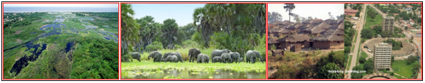
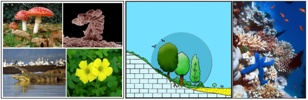

# Écologie générale, bases et fondements {#ecogen}

##	Quelques définitions

L'**écologie** est une méta-discipline, une matière carrefour. C'est un ensemble de connaissances en physique, en biologie, en chimie, en sciences sociales, en géographie, en mathématiques.

Le mot a été proposé par le biologiste allemand Ernst Haeckel au XIXe siècle, composé de _**oikos**_ qui signifie la maison, le milieu, l’habitat et de _**logos**_ : le discours, la science. L’écologie est donc la science de l’habitat. En d’autres termes, l’écologie désigne la science qui a pour objet les relations des êtres vivants (_animaux, végétaux, micro-organismes, etc._) entre eux ainsi qu'avec leur habitat ou leur milieu environnant, ou l’environnement dans son ensemble. C’est l’étude des _**relations biotiques**_ (_interactions du vivant sur le vivant dans un écosystème_) négatives ou positives.

L’habitat décrit (et cartographie) l'endroit et les caractéristiques du « milieu » dans lequel une population d'individus d'une espèce donnée (ou d'un groupe d'espèces symbiotes ou vivant en guilde) peut normalement vivre et s'épanouir.

L'**environnement** est _l'ensemble des éléments (biotiques ou abiotiques) qui entourent un individu ou une espèce et dont certains contribuent directement à subvenir à ses besoins », ou encore « l'ensemble des conditions naturelles (physiques, chimiques, biologiques) et culturelles (sociologiques) susceptibles d’agir sur les organismes vivants et les activités humaines_.

Ces interactions déterminent la **distribution** et l'**abondance** des organismes vivants sur Terre. Pour ce fait, l'écologie est souvent classée dans le champ de la biologie. Elle étudie deux grands ensembles : celui des êtres vivants (**biocénose**) et le milieu physique (**biotope**), le tout formant l'**écosystème** (_habitat local comprenant : le milieu, les êtres vivants et l’ensemble des échanges qui s’y produisent. Une région, une forêt, une mare peut constituer un écosystème, un aquarium est un écosystème, l'océan en est un autre et la flaque d'eau en est un aussi bien que ce puisse être minuscule_).

##	Les fondamentaux : niveaux d'étude en écologie

En tant que science biologique, l'écologie est fortement liée à d'autres branches de la biologie, principalement :

## cd

## ef