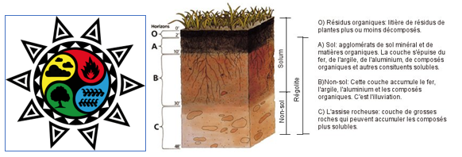

# Agroécologie, des définitions variées, des principes communs {#agroecologie}

##	Émergence, succès et diversité du concept

L'étude objective de la nature et de l'univers physique qui régnait avant le développement de la science moderne (__la philosophie naturelle__), distingue quatre éléments majeurs : l'air, le feu, l'eau et la terre (Figure 3.1). De ces éléments, la terre serait celui qui n’a pas existé dès l’origine.

Il a fallu des millénaires pour que la mince couche de terre arable d’une quarantaine de centimètres à laquelle nous devons la vie puisse se constituer. Univers silencieux d’une grande complexité, siège d’une activité intense, elle est régie par une sorte d’intelligence mystérieuse. 

## ab

## cd

## ef